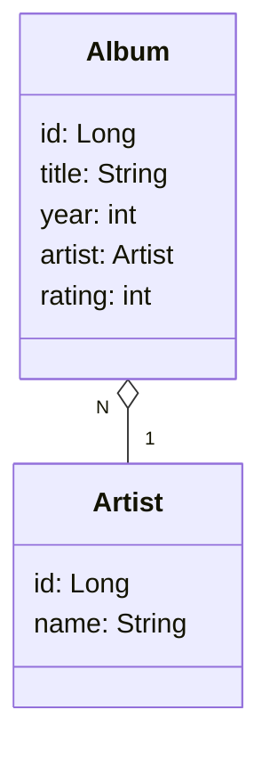

# Album Review API
## Descrição
Esse projeto visa servir como um local onde é possível registrar álbuns musicais e estabelecer uma nota.

## Diagrama de classes

```mermaid
classDiagram
    class Album {
        id: Long
        title: String
        year: int
        artist: Artist
        rating: int
    }

    class Artist {
        id: Long
        name: String
    }

    Album "N" o-- "1" Artist
```
