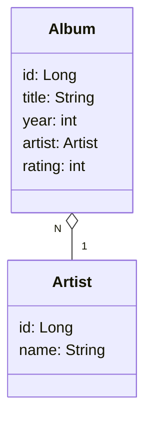

# Album Review API (WIP)
## Descrição
Esse projeto visa servir como um local onde é possível registrar álbuns musicais e estabelecer uma nota.
Ao criar um album, você estabelece uma nota que deve estar entre 1 e 5. O registro do álbum somente é possivel quando existe um artista vinculado.

## Diagrama de classes


## Como rodar a aplicação.
### Crie um artista
`POST` /artists

Exemplo de requisição:
```
{
  "name": "The Beatles",
}
```
### Crie um album
`POST` /albums

Exemplo de requisição:
```
{
  "title": "Revolver",
  "year": 1966,
  "rating": 5,
  "artist_id": 1
}
```
## Acessando a documentação
Rode a aplicação e acesse o endpoint /swagger-ui/index.html. Por exemplo, se estiver rodando localmente, acesse através do http://localhost:8080/swagger-ui/index.html:

## Melhorias futuras
Teste unitários
Melhorias na Documentação
